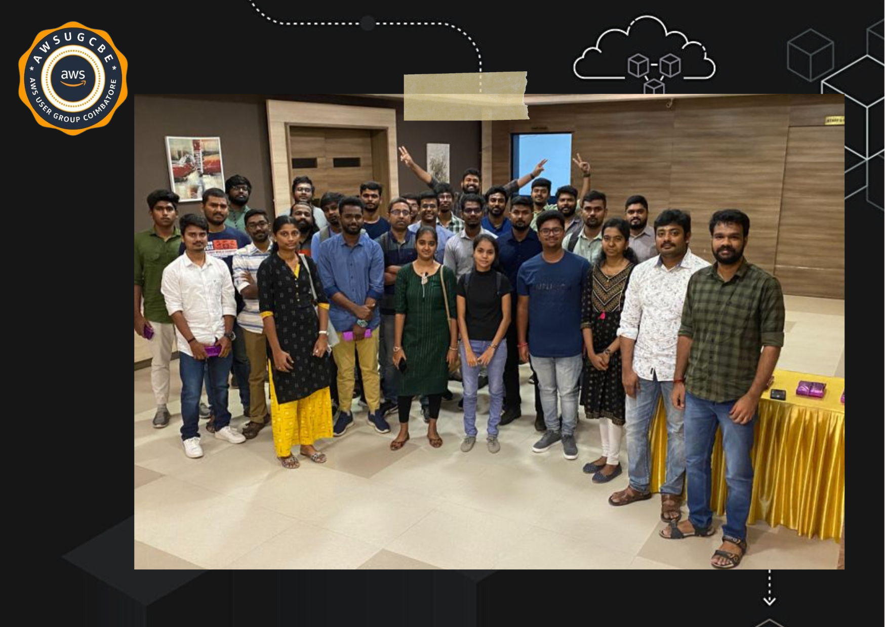

# Aws Community Coimbatore 

To be Part with such an event within a week was amazing and thanks to everyone for making it happen 😇 Shows the appetite and strength of our community 🤝

* "AWS re:Invent" annual conference hosted by Amazon Web Services where they showcase new products and services, host technical sessions and hands-on workshops, and offer certifications.

* "AWS Community Day" events organized by local AWS user groups where members of the community come together to share knowledge and best practices for using AWS.

* "AWS Summit" series of events held in different cities around the world where customers can learn about the latest AWS services and solutions from AWS experts.

* "AWS Architecture" website that provides best practices and architectural patterns for building applications on AWS.

* "AWS Blog" that features technical articles, tutorials, and case studies on how customers are using AWS to innovate and grow their businesses.
