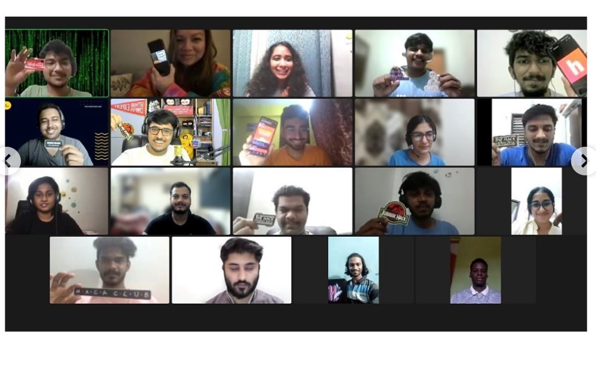

# Contribute to the Growth of Your Campus Hack Club: A Guide for Club Leads

### As a club lead for your campus hack club, you have the opportunity to make a real impact on the future of technology. By creating a welcoming and inclusive environment, fostering collaboration and mentorship, and providing opportunities for members to learn new skills and showcase their work, you can help your club become a valuable asset to the tech community.

* Build a Strong Community: Create a positive and inclusive environment where all members feel welcome and valued. Encourage open communication, collaboration, and mentorship among members.

* Plan Regular Meetings and Events: Schedule regular meetings, workshops, and hackathons to provide opportunities for members to learn new skills and showcase their work.

* Invite Guest Speakers: Invite guest speakers from the tech industry to share their experiences and insights with your club. This will give members the opportunity to learn from experts and make valuable connections.

* Encourage Participation in Hackathons: Participating in hackathons is a great way for members to apply what they've learned and gain experience working on real-world projects. Encourage members to participate in hackathons and help them prepare by providing resources and training.

* Foster Mentorship: Encourage senior members to mentor newer members and help them develop the skills they need to succeed in the tech industry.

* Promote your club: Utilize social media and other platforms to promote your club and attract new members. Reach out to other clubs, departments, and organizations on campus to collaborate and gain visibility.

* Be available and approachable: Be available for your members to reach out and ask for help, guidance or any other support.
